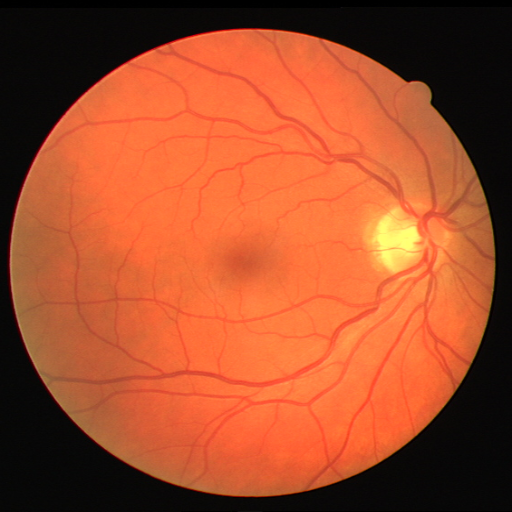
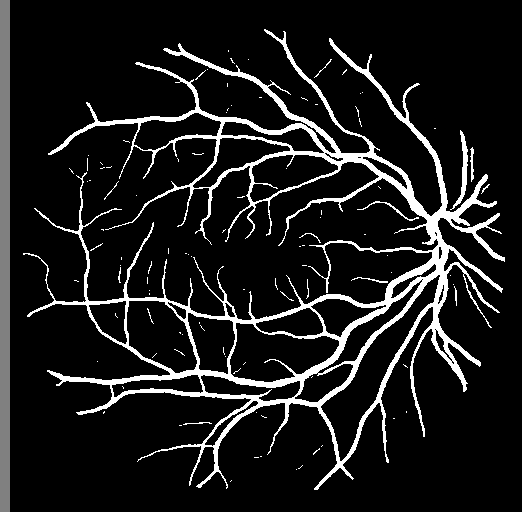
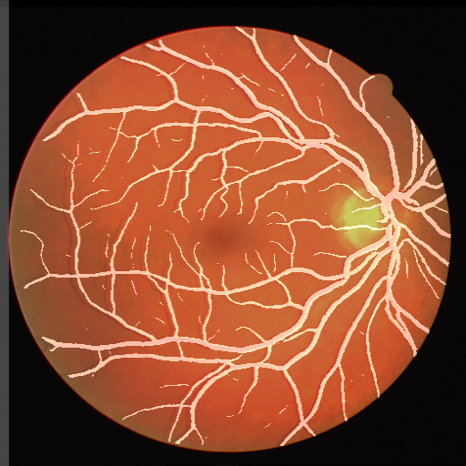
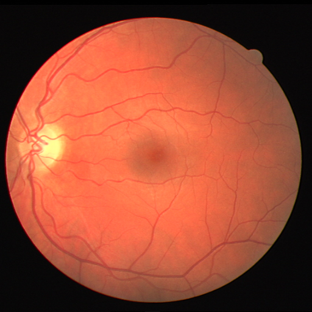
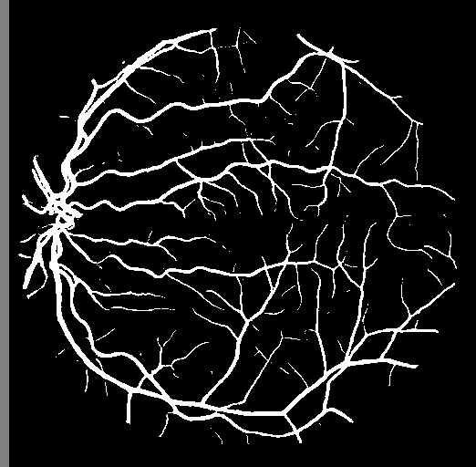
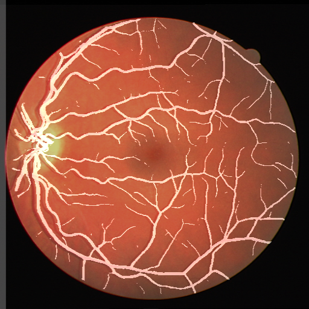
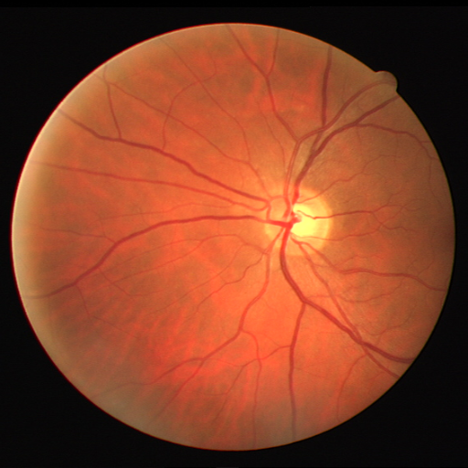
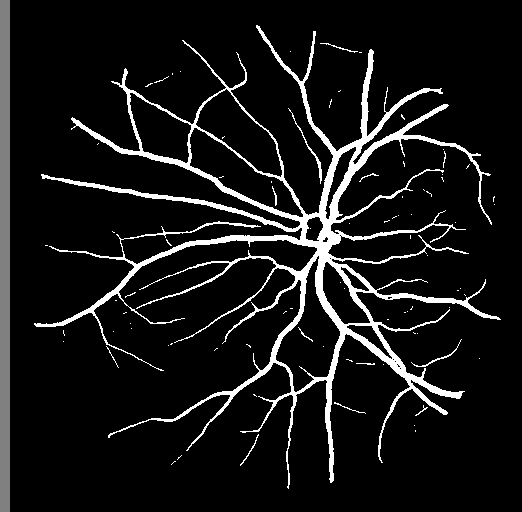
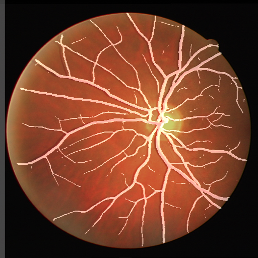

# Retina Blood Vessels Segmentation
This is an implementation of the research paper <a href = "https://researchbank.swinburne.edu.au/file/fce08160-bebd-44ff-b445-6f3d84089ab2/1/2018-xianchneng-retina_blood_vessel.pdf">"Retina Blood Vessel Segmentation Using A U-Net Based Convolutional Neural Network"</a> written by Wang Xiancheng, Li Weia, *et al.*

## Inspiration
Various eye diseases can be diagnosed through the characterization of the retinal blood vessels. The characterization can be extracted by using proper imaging techniques and data analysis methods. In case of eye examination, one of the important tasks is the retinal image segmentation.The paper presents a network and training strategy that relies on the data augmentation to use the available annotated samples more efficiently, to segment retinal blood vessels using a UNET convolutional neural network.

## Dataset
We have used the <a href = "https://drive.grand-challenge.org/">Digital Retinal Images for Vessel Extraction (DRIVE)</a> dataset for retinal vessel segmentation.
It consists of a total of JPEG 40 color fundus images; including 7 abnormal pathology cases. Each image resolution is 584x565 pixels with eight bits per color channel (3 channels), resized to 512x512 for our model.  

### Guidelines to download, setup and use the dataset
The DRIVE dataset may be downloaded <a href = "https://drive.google.com/drive/folders/13-zz_Gtxo1oe7Vu3P2ZO9FocZrhXlts5?usp=sharing">here</a> as two files named *training.zip* and *test.zip*. 

**Please write the following commands on your terminal to extract the file in the proper directory**
```bash
  $ mkdir drive
  $ unzip </path/to/dataset.zip> -d </path/to/drive>
```
The resulting directory structure should be:
```
/path/to/drive
    -> train
        -> image
            -> 21_training_0.tif
            -> 22_training_0.tif
               ...
        -> mask
            -> 21_training_0.gif
            -> 22_training_0.gif
    -> test
        -> image
            -> 01_test_0.tif
            -> 02_test_0.tif
               ...
        -> mask
            -> 01_test_0.gif
            -> 02_test_0.gif
```

## Model Components
The UNET CNN architecture may be divided into the *Encoder*, *Bottleneck* and *Decoder* blocks, followed by a final segmentation output layer. 

- Encoder: There are 4 Encoder blocks, each consisting of a convolutional block followed by a Spatial Max Pooling layer. 
- Bottleneck: The Bottleneck consists of a single convolutional block.
- Decoder: There are 4 Decoder blocks, each consisting of a deconvolution operation, followed by a convolutional block, along with skip connections.

**Note**: The *convolutional block* consists of 2 conv2d operations each followed by a BatchNorm2d, finally followed by a ReLU activation.


## Implementation Details
- Image preprocessing included augmentations like HorizontalFlip, VerticalFlip, Rotate.
- Dataloader object was created for both training and validation data
- Training process was carried out for 50 epochs, using the Adam Optimizer with a Learning Rate 1e-4.
- Validation was carried out using DiceLoss and Intersection over Union Loss. 

## Installation and Quick Start
To use the repo and run inferences, please follow the guidelines below

- Cloning the Repository: 

        $ git clone https://github.com/srijarkoroy/segRetino
        
- Entering the directory: 

        $ cd segRetino/
        
- Setting up the Python Environment with dependencies:

        $ pip install -r requirements.txt

- Running the file for inference:

        $ python3 test.py
        
Running the test file downloads the pretrained weights of the UNET Model that we have trained on the DRIVE Dataset. However if you want to re-train the model please mention the path to your dataset on you local machine after augmentations, inside the ```train.py``` file, as:

```python
train_x = sorted(glob(<path/to/augmented/train/image/folder/>))
train_y = sorted(glob(<path/to/augmented/mask/image/folder/>))

valid_x = sorted(glob(<path/to/test/image/folder/>))
valid_y = sorted(glob(<path/to/test/mask/folder/>))
```
Once the path has been mentioned, the model may be trained by running the command:
```bash
  $ python3 train.py
```

The test file saves two images in the mentioned paths, a masked image showing only the blood vessels, and a blend image showing the blood vessels within the retina. If you don't want to save the blend image, consider running the following code snippet:

```python
# Creating the SegRetino object initialized with the test image path
seg = SegRetino('<path/to/test/img>')

# Running inference
seg.inference(set_weight_dir = 'unet.pth', path = '<path/to/save/masked/image>', blend=False, blend_path = None)
```
Check out the standalone demo notebook and run segRetino inferences <a href = 'https://colab.research.google.com/github/srijarkoroy/segRetino/blob/main/demo/seg_retino_demo.ipynb'>here</a>.

**Note**: Is is advisable to use a GPU for running the imferences since performing segmentation on 512x512 images with a heavy UNET architecture is expensive.

## Results from Implementation
Original Image | Masked Image | Blend Image |
:-------------: | :---------: | :-----: |
| |  |
| |  |
| |  |
